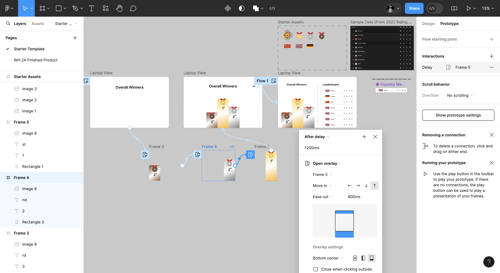

# euro-scorecard

https://euro-scoreboard.vercel.app/
Made this while attending a workshop of WaffleHacks. Converted a Figma design to a website using HTML, CSS and Javascript. A nice lil fun exercise. I'm attaching the figma design for reference:

